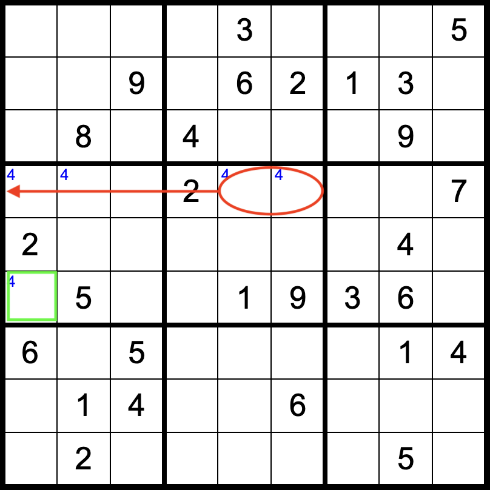
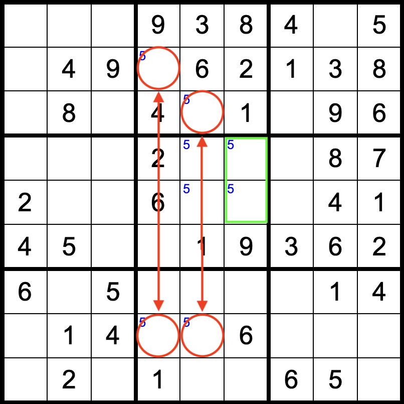
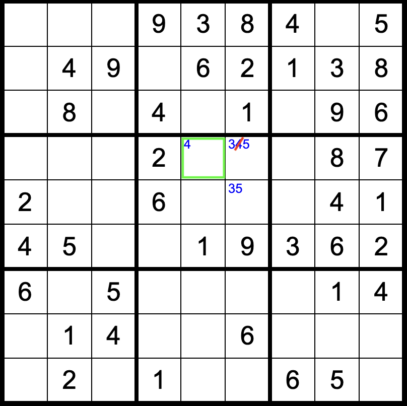
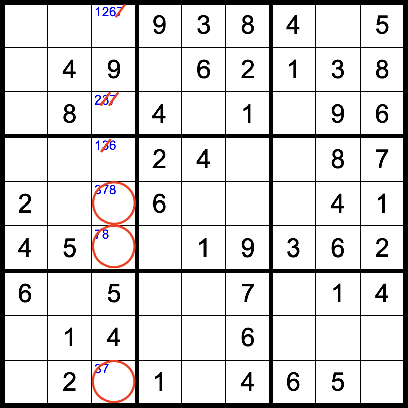

When solving sudoku puzzles, I used to only know the basics - look for cells
where only one number can exist, look for the last remaining number in a row, et
cetera. These strategies can definitely solve some puzzles, but they can only
take you so far. I eventually decided to learn a few more techniques, and found
that the number of puzzles I could solve greatly increased.

This is my mini dump of the strategies I've learned. I wouldn't say that 100% of
all puzzles are solvable using this set of techniques, but I'd say that it's a
good tradeoff between solving marginally more puzzles and spending too much time
learning sudoku tricks.

## Strategies

My principle with approaching sudoku puzzles is to avoid using backtracking as
much as possible; I feel that the "guess-and-check" behavior of backtracking
sort of defeats the purpose of the puzzle.

### Basic Techniques

The most basic techniques are those that identify "obvious" cells, where a
number _must_ be in a certain cell because either it's the only possible value
for that cell or it only appears in that cell for the cell's row, column, or 3x3
box.

### Spears

This is the first technique I learned, when I was watching my dad do a sudoku
puzzle on a plane many years go. I don't know if there's a formal name, but I
visualize them as "spears". Within a 3x3 box, if a number is only possible in
cells that are within the same row or column, then that number can be eliminated
from all other cells in that row or column.

A proof (like almost every proof for a sudoku technique) is by contradiction. If
the particular number was placed in the same row or column outside of that 3x3
box, then there would be no legal placement of the number within the 3x3 box,
based on our description of the scenario. Therefore, the number must not exist
in that row or column outside of the 3x3 box.

In the above example, the middle 3x3 box has only two cells that could be a 4,
and those two cells are in the same row. Therefore, no other cell in that row
outside of the middle 3x3 box can be a 4, and so the bottom left cell (green) in
the left-middle 3x3 box must be a 4.

## Double Spears

This builds upon the spear technique. If there are two 3x3 boxes on the same row
or column, and a particular number is only possible in the same two columns or
rows, respectively, then that number can be eliminated from the third 3x3 box in
those two columns or rows.

In a similar proof, if the number in the third 3x3 box appeared in one of the
two initial columns or rows, then one of the two "matching" boxes would not be
completable.

Technically, this is equivalent to finding a row or column whose only possible
positions for a given number all lie within the same 3x3 box. In such case, that
number can be eliminated for all other cells inside that 3x3 box that are not
within that row or column.

The above example is a continuation of the same puzzle from the single spear
example. We notice that 5 appears as a possibility in only the left two columns
of the top-middle and bottom-middle 3x3 boxes. This means that we can eliminate
5 from the first and second column of the middle 3x3 box.

As mentioned previously, this is the same consequence as realizing that within
the sixth column, 5 can only appear within the middle 3x3 box, and so within the
middle 3x3 box it cannot be anywhere besides its right-most column.

## Hidden Groups

Hidden groups are one key technique to being able to solve many more sudoku
puzzles. Within a single row, column, or 3x3 box, if a set of _n_ numbers could
possibly exist in a set of _n_ positions, then all other numbers can be
eliminated from those positions.

Naturally, the easiest hidden group to spot is of size _n=2_, though _n=3_ is
also usually identifiable. Larger groups are harder to spot, and the case where
_n_ equals the total number of unplaced numbers in the row, column, or 3x3 box
is not useful, as there are no numbers to eliminate.

As proof, consider placing a number from outside the group of _n_ numbers into
one of those _n_ positions. You would be left placing _n_ numbers into _n-1_
positions, which is impossible. Thus, those _n_ positions are only fillable by
the _n_ numbers.

This example (yet another continuation of the ones above) shows a hidden group
resolving the location of a 4 in the middle 3x3 box. We know that 4 is a
candidate for the top-middle and top-right cells in this box. Using the above
strategies, the right two empty cells in this box are the only two possible
cells to contain 3 and 5. This is a set of two numbers that can only appear in
two cells in the 3x3 box, so it is a hidden group. This means that 4 is removed
as a possibility from the top right cell, and so 4 must be in the top middle
cell.

## Naked Groups

Naked groups are essentially the converse of a hidden group. If there is a set
of _n_ positions in a row, column, or 3x3 box whose values are only within a set
of _n_ numbers, then those _n_ numbers can be removed from all other positions
in the row, column, or 3x3 box.

The difference between the two group techniques is that for naked groups, the
set of positions must contain the set of numbers, while for hidden groups, the
set of numbers must exist in a certain set of positions. The resulting
eliminations also differ; for a naked group, the set of numbers is removed from
the other positions, while for a hidden group, the other numbers are removed
from the set of positions.

The logic behind this technique is similar to hidden groups. If one of the _n_
numbers appeared outside of the _n_ positions, then there would be _n-1_ numbers
left to fill _n_ positions, which is an impossibility.

The example (continued from above for the last time) shows that 3, 7, and 8 form
a naked group in the third column. Therefore, those three numbers can be
eliminated from all other cells in the column. For this example in particular,
it reveals that the bottom-right cell of the top-left 3x3 box must be a 2. From
here, every other cell in the puzzle is solvable through basic techniques, and
the puzzle is done.

## Appendix

Many more techniques exist, but I find them to be more niche (and not
necessarily intuitive). If you want to learn more, see the
[Sudoku Wiki](https://www.sudokuwiki.org/Main_Page).
